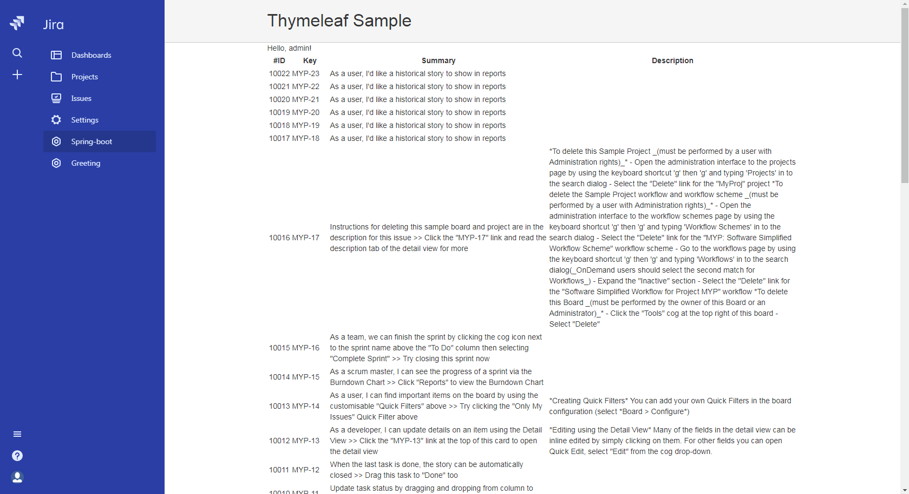

# spring-boot-cloud

Sample JIRA add-on for cloud environment.

Requires [Java 8](http://www.oracle.com/technetwork/java/javase/downloads/index.html) and [Atlassian SDK](https://developer.atlassian.com/docs/getting-started/set-up-the-atlassian-plugin-sdk-and-build-a-project).

## generated using  
`mvn archetype:generate -DarchetypeGroupId=com.atlassian.connect -DarchetypeArtifactId=atlassian-connect-spring-boot-archetype -DarchetypeVersion=1.4.3 -DgroupId=com.sln -DartifactId=spring-boot-cloud -Dversion=1.0-SNAPSHOT -Dpackage=com.sln.cloud -DinteractiveMode=false`

## how to run
- if you need help see [cloudExample](https://developer.atlassian.com/cloud/jira/platform/getting-started/)
- `ngrok http 8080`
- edit "base-url" in application.yml
- `mvn spring-boot:run`
- Open [Manage add-ons] at *https://[your_cloud_site].atlassian.net/plugins/servlet/upm*
- Upload Add-on: *https://[your_ngrok_site].ngrok.io/atlassian-connect.json*

## Notice
- this add-on uses [Atlassian Connect Spring Boot](https://bitbucket.org/atlassian/atlassian-connect-spring-boot?_ga=2.158853113.210664904.1525247698-1793353365.1522254320) to connect to JIRA via REST API (`getForEntity()`)
	- for more infor see this [blog post](https://developer.atlassian.com/blog/2016/03/connecting-connect-with-spring-boot/)
- to deserialize JSON responses this add-on uses [JIRA REST Java Client Library](https://ecosystem.atlassian.net/wiki/spaces/JRJC/overview)
	- see [source](https://bitbucket.org/atlassian/jira-rest-java-client/overview)

